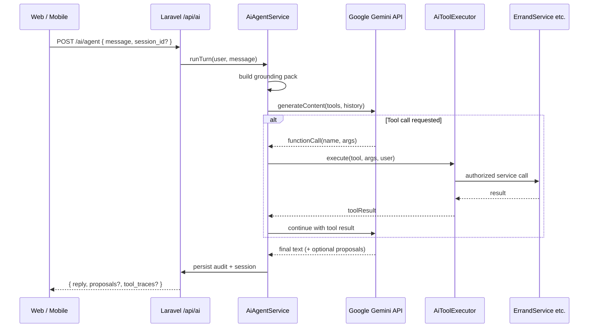

# Errandly AI Agent — Architecture

The **Errandly AI Agent** is a server-orchestrated Gemini assistant that understands platform context, calls **approved tools** (wrapped APIs), and completes user requests within strict safety policies.

---

## 1. High-level flow



**Rule:** Gemini never receives the raw `Bearer` token. Tools execute **as the authenticated user** inside Laravel.

---

## 2. Components (Laravel)

| Class / module | Responsibility |
|----------------|----------------|
| `App\Services\Ai\AiAgentService` | Turn loop, Gemini client, max iterations |
| `App\Services\Ai\AiToolRegistry` | Tool name → handler + JSON schema |
| `App\Services\Ai\AiToolExecutor` | Authz, policy check, invoke handler, sanitize output |
| `App\Services\Ai\AiGroundingBuilder` | Build context from [01-system-context](./01-system-context-for-gemini.md) + DB |
| `App\Services\Ai\AiProposalService` | Store pending proposals (create errand, cancel, etc.) |
| `App\Services\Ai\GeminiClient` | HTTP to Vertex AI / AI Studio; structured output |
| `App\Http\Controllers\Api\AiAgentController` | HTTP entrypoints |
| `App\Jobs\Ai\*` | Background vision/fraud jobs |

---

## 3. Agent turn loop (pseudocode)

```php
public function runTurn(User $user, string $message, ?string $sessionId): AgentResponse
{
    $session = $this->sessions->resolve($user, $sessionId);
    $grounding = $this->grounding->build($user);
    $history = $session->getRecentMessages(limit: 20);

    $contents = $this->formatForGemini($grounding, $history, $message);
    $tools = $this->registry->toolsForUser($user);

    for ($i = 0; $i < config('ai.max_tool_iterations', 8); $i++) {
        $response = $this->gemini->generate($contents, $tools);

        if (!$response->hasFunctionCalls()) {
            return $this->finalize($session, $response);
        }

        foreach ($response->functionCalls() as $call) {
            $result = $this->executor->execute($user, $call->name, $call->args);
            $contents = $this->appendToolResult($contents, $call, $result);
        }
    }

    throw new AiMaxIterationsException();
}
```

---

## 4. Tool risk tiers

| Tier | Description | Execution |
|------|-------------|-----------|
| **R0 — Read** | Get status, list errands, explain policy | Immediate |
| **R1 — Analyze** | Vision analysis, suggestions, flags | Immediate; no DB writes |
| **R2 — Propose** | Build create-errand payload, cancel draft | Writes `ai_proposals` only |
| **R3 — Confirm write** | Post errand, cancel, send message | Requires `confirmation_token` from user |
| **R4 — Forbidden** | Release escrow, approve KYC, admin refund | **Not exposed as tools** |

Gemini receives only R0–R3 tools applicable to the user's role.

---

## 5. Confirmation flow (R3)

For destructive or financial-adjacent actions:

1. Agent calls `propose_cancel_errand` → returns `proposal_id` + summary.
2. Client shows UI: “Cancel errand X? Refund: ₦…” **[Confirm]**.
3. Client calls `POST /api/ai/confirm` with `{ proposal_id, confirmation_token }`.
4. Server validates token (single-use, 5 min TTL, bound to user + proposal).
5. Server executes real `ErrandService::cancelByCustomer` etc.

Gemini **cannot** skip step 3–5.

---

## 6. Session model

| Field | Purpose |
|-------|---------|
| `ai_sessions.id` | UUID |
| `user_id` | Owner |
| `channel` | `customer_app`, `runner_app`, `admin` |
| `metadata` | JSON — last errand context |
| `expires_at` | Auto cleanup |

Messages stored in `ai_messages` (role: user | model | tool).

---

## 7. Client integration

### Customer / runner apps

- Floating **“Ask Errandly”** entry on home, errand detail, wallet.
- `POST /api/ai/agent` with streaming optional (SSE later).
- Render **proposals** as native UI cards (maps, forms), not raw JSON.

### Admin

- Dispute page: **“AI summary”** button (standalone endpoint).
- KYC queue: **risk badges** from background job.

---

## 8. Error handling

| Error | User-facing behavior |
|-------|----------------------|
| Tool not allowed | “I can’t do that for your account type.” |
| Errand not found | “I couldn’t find that errand.” |
| Gemini timeout | Retry once; then “Please try again.” |
| Policy block | Explain rule (e.g. OTP required) |

Never expose stack traces or internal IDs.

---

## 9. Observability

- Log `ai_requests` (latency, model, token estimate, status).
- Log each `ai_tool_calls` (name, args hash, success).
- Dashboard: tool error rate, confirmation conversion, flag volumes.

---

## 10. Related docs

- Tool schemas: [04-tool-definitions.md](./04-tool-definitions.md)
- Safety: [05-safety-governance.md](./05-safety-governance.md)
- Backend files: [07-backend-integration.md](./07-backend-integration.md)
